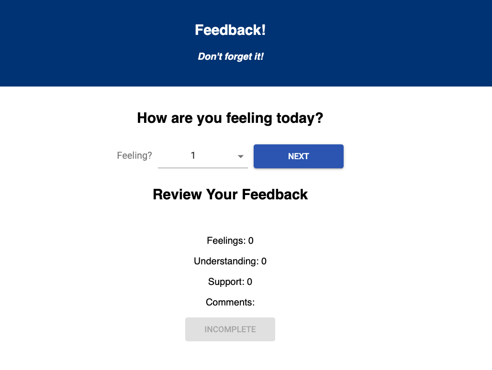

# Feedback form

This is a fully functional feedback form. It asks a user to submit information on how they feel, how well they understand subject matter, how well they feel supported, and to leave a comment. Once the user has input all necessary information, they can submit the form to a database for later perusal. This app also features an admin page that allows you to review all current feedback and allows you to delete feedback you've read.

## Built With
This project uses html/css react and redux for the front-end and node.js and express.js as a server and finally postgresql for a database.

## Getting Started
To get this project running you'll have to:
* fork and clone this repo. 
* create a postgresql database using the queries in the 'Database.sql' file.
star:
- You'll want to run a postrgesql server while using this project
* in the directory you cloned this repo to, you'll need to run `npm install` to get the dependencies installed for this project.
* once you have your database created and running and you've installed all dependencies, you'll have to run your express server. You should be able to do so by running `npm run server`.
* Once your server is running, you can run the project in a browser by running `npm run client`

## Prerequisites
In order to run this project you'll need to install:

* [node.js](https://nodejs.org/en/) 
* [express.js](https://expressjs.com/) 
* [react](https://reactjs.org/) 
* [redux](https://redux.js.org/)
* [postgres](https://www.postgresql.org/) and 
* [pg](https://node-postgres.com/)
* All of these can also be installed using NPM (this is my preferred method)
* [NPM](https://www.npmjs.com/)

## Installing
* Download this project.
* install prerequisite libraries listed above.
* run `npm install` from project directory in terminal
* run `npm run server` to start your express server
* run `npm run client` to open this project up in a browser

## Screen Shot

## Completed Features
* Developed react components that display on the DOM using react's hash-routing
* The DOM has a running tally "review" of all the current form the user is filling out.
* Once all data is collected, user is able to submit feedback, this sends data to a database
* User is taken to a thank you page where they can choose to submit more feedback, this will reset the form for the next user.
* Admin page that displays all feedback data in a table.

## Author
[Stefen Menzel](https://github.com/stefenmenzel)
